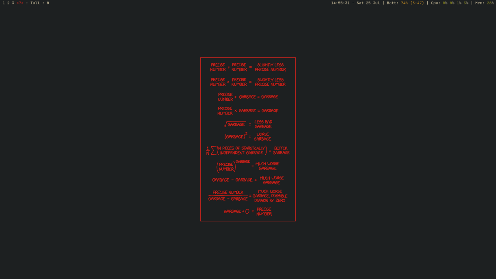

# My dotfiles

Dotfiles are what make my desktop and applications therein look nice. Mine are
available on github for people who may want to use them, most likely for
inspiration.

They are all following the gruvbox theme - currently.

